# **Architecture**
## **Onion architecture**
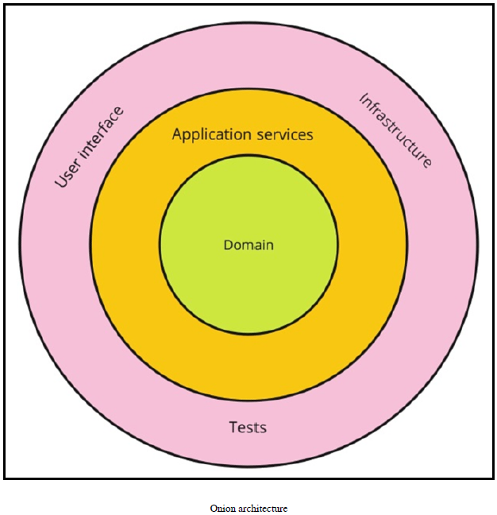

## **CQRS architecture**
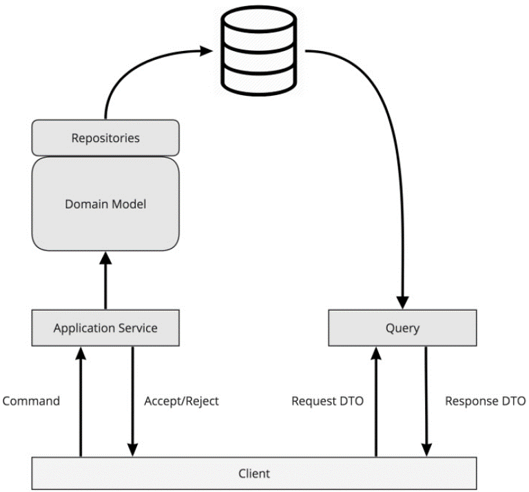
## **Blog architecture**

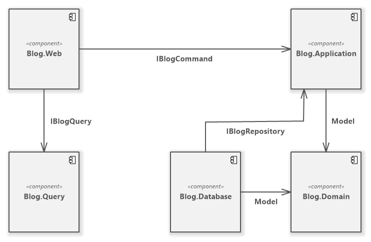


# **Visual Studio project structure
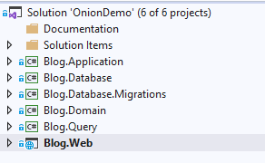


# **First iteration
## The model


```c#
public class Blog
{
    private readonly List<Post> _posts;

    /// <summary>
    ///     Used only by Entity framework
    /// </summary>
    protected Blog()
    {
    }

    public Blog(Guid id)
    {
        Id = id;
        _posts = new List<Post>();
    }

    public Guid Id { get; }
    public IEnumerable<Post> Posts => _posts;

    public void AddPost(Post post)
    {
        _posts.Add(post);
        Validate();
    }

    private void Validate()
    {
        // Max 10 posts
        if (_posts.Count > 10) throw new MaxPostLimitExceeded($"Maximum postings limit exceeded. You already has {_posts.Count} postings");
    }
}
```


​    
```c#
public class Post
{
    /// <summary>
    ///     Used only by Entity framework
    /// </summary>
    public Post()
    {
    }

    public Post(Guid id)
    {
        Id = id;
    }

    public Guid Id { get; }
}
```


## Entity framework

```c#
public class BlogContext : DbContext
{
    public BlogContext(DbContextOptions<BlogContext> options) : base(options)
    {
    }

    public DbSet<Post> Posts { get; set; }
    public DbSet<Domain.Model.Blog> Blogs { get; set; }

    protected override void OnModelCreating(ModelBuilder modelBuilder)
    {
        //this will apply configs from separate classes which implemented IEntityTypeConfiguration<T>
        modelBuilder.ApplyConfigurationsFromAssembly(Assembly.GetExecutingAssembly());
    }
}
```


```c#
public class BlogConfiguration : IEntityTypeConfiguration<Domain.Model.Blog>
{
    public void Configure(EntityTypeBuilder<Domain.Model.Blog> builder)
    {
        builder.HasKey(a => a.Id);
    }
}
```


```c#
public class PostConfiguration : IEntityTypeConfiguration<Post>
{
    public void Configure(EntityTypeBuilder<Post> builder)
    {
        builder.HasKey(a => a.Id);
    }
}
```


From Startup.cs

```c#
    public void ConfigureServices(IServiceCollection services)
    {
        // Add-Migration Initial -context Blog.Database.BlogContext -Project Blog.Database.Migrations
        // Update-Database Initial -context Blog.Database.BlogContext -Project Blog.Database.Migrations
        services.AddDbContext<BlogContext>(options =>
            options.UseSqlServer(Configuration.GetConnectionString("DefaultConnection"),
                x => x.MigrationsAssembly("Blog.Database.Migrations")));
```


From appsettings.json

```json
{
  "ConnectionStrings": {
    "DefaultConnection": "Server=localhost;Database=BlogDb;Trusted_Connection=True;MultipleActiveResultSets=true"
  },
```


## Initial migration
Add-Migration:

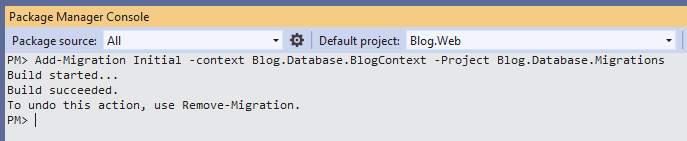

Migration project:

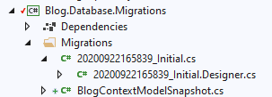

Update-Database:

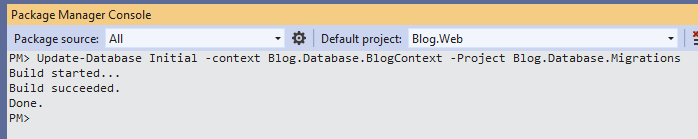

SQL database:

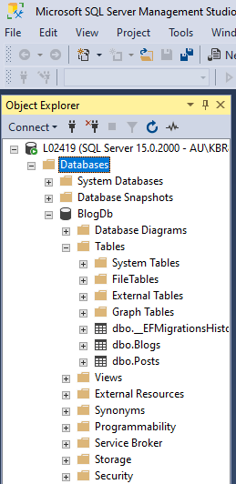

Migrations history

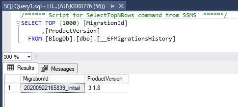

# **Second iteration**
## The model

```c#
public class Post
{
    /// <summary>
    ///     Used only by Entity framework
    /// </summary>
    public Post()
    {
    }

    public Post(Guid id)
    {
        Id = id;
    }

    public Guid Id { get; }

    public string Body { get; private set; }

    public string Title { get; private set; }
}
```
## Second iteration - Migration
Add-Migration:

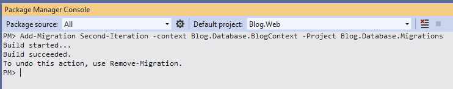

Migration project:

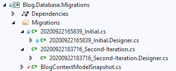

Update-Database:

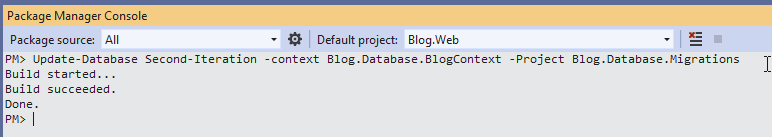

SQL database:


Migrations history

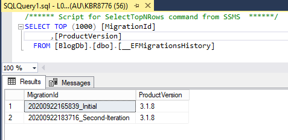

# **Sql server and SqLite**

launchSettings:

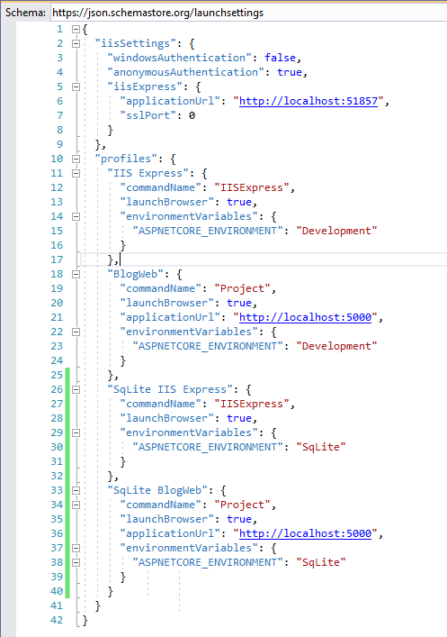

launchSettings:


Program.cs
```c#
    public class Program
    {
        public static void Main(string[] args)
        {
            CreateHostBuilder(args).Build().Run();
        }

        public static IHostBuilder CreateHostBuilder(string[] args)
        {
            var assemblyName = typeof(Startup).GetTypeInfo().Assembly.FullName;
            return Host.CreateDefaultBuilder(args)
                .ConfigureWebHostDefaults(webBuilder => { webBuilder.UseStartup(assemblyName); });
        }
    }
```

Select start enviroment:

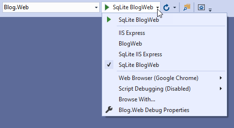

## Sql server

appsettings.json

Startup.cs

## SqLite
SqLite start enviroment:

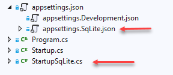

appsettings.SqLite.json:

```json
    {
      "ConnectionStrings": {
        "DefaultConnection": "DataSource = blog.db;"
      },
      "Logging": {
        "LogLevel": {
          "Default": "Information",
          "Microsoft": "Warning",
          "Microsoft.Hosting.Lifetime": "Information"
        }
      },
      "AllowedHosts": "*"
    }
```
StartupSqLite.cs:

```c#
        public void ConfigureServices(IServiceCollection services)
        {

            // Add-Migration Initial -context Blog.Database.BlogContext -Project Blog.Database.Migrations
            // $env:ASPNETCORE_ENVIRONMENT='SqLite'
            // Update-Database Initial -context Blog.Database.BlogContext -Project Blog.Database.Migrations
            services.AddDbContext<BlogContext>(options =>
                options.UseSqlite(Configuration.GetConnectionString("DefaultConnection"),
                    x => x.MigrationsAssembly("Blog.Database.Migrations")));

            // Command and Query
            services.AddScoped<IBlogCommand, BlogCommand>();
            services.AddScoped<IBlogQuery, BlogQuery>();
            services.AddScoped<IPostQuery, PostQuery>();

            // Repository
            services.AddScoped<IBlogRepository, BlogRepository>();

            services.AddControllersWithViews();
        }

        // This method gets called by the runtime. Use this method to configure the HTTP request pipeline.
        public void Configure(IApplicationBuilder app, IWebHostEnvironment env)
        {
            app.UseDeveloperExceptionPage();
```

### SqLite database migration

:

SqLite start enviroment:

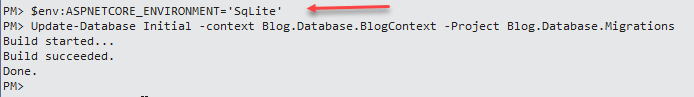


# **Iteration-3 (edit and delete posts)**

## Commands
```c#
    public class Command
    {
        public class CreatePost
        {
            public Guid BlogId { get; set; }
            public PostDto Post { get; set; }
        }

        // iteration 3
        public class UpdatePost
        {
            public Guid BlogId { get; set; }
            public PostDto Post { get; set; }
        }

        // iteration 3
        public class DeletePost
        {
            public Guid BlogId { get; set; }
            public PostDto Post { get; set; }
        }

```
## IBlogCommand

```c#
    public interface IBlogCommand
    {
        Task Execute(Command.CreatePost command);
        Task Execute(Command.CreateBlog command);

        // iteration 3
        Task Execute(Command.UpdatePost command);

        //TODO - iteration 4
        //    Task Execute(Command.UpdateBlog command);
        //    Task Execute(Command.DeleteBlog command);
    }
```

## BlogCommand

# **Iteration-4 (optimistic concurrency)**


## Model
```c#
    public class Post
    {
        public Post(Guid id, Guid blogId, string title, string body)
        {
            Id = id;
            BlogId = blogId;
            Title = title;
            Body = body;
            Validate();
        }

        public Guid Id { get; }
    
        public Guid BlogId { get; }
    
        public string Body { get; private set; }
    
        public string Title { get; private set; }
    
        public byte[] RowVersion { get; set; }
```

```c#
    public class PostDto
    {
        public Guid Id { get; set; }
        public Guid BlogId { get; set; }

        public string Body { get; set; }

        public string Title { get; set; }
        public byte[] RowVersion { get; set; }
    }
```

## Application service

BlogCommand:

```c#
        // iteration 3
        // iteration 4
        async Task IBlogCommand.Execute(Command.UpdatePost command)
        {
            var blog = await _repository.Load(command.BlogId);
            var post = blog.Posts.First(a => a.Id == command.Post.Id);
            post.UpdateTitle(command.Post.Title);
            post.UpdateBody(command.Post.Body);
            await _repository.Save(blog, command.Post.RowVersion);
        }
```

```c#
    public class PostQuery : IPostQuery
    {
        private readonly BlogContext _db;

        public PostQuery(BlogContext db)
        {
            _db = db;
        }

        async Task<PostDto> IPostQuery.Get(Guid id)
        {
            return await _db.Posts.AsNoTracking()
                .Select(a => new PostDto {Id = a.Id, Title = a.Title, BlogId = a.BlogId, Body = a.Body, RowVersion = a.RowVersion})
                .FirstOrDefaultAsync(a => a.Id == id);
        }


        async Task<IEnumerable<PostDto>> IPostQuery.GetAllByBlog(Guid blogId)
        {
            return await _db.Posts.AsNoTracking().Where(a => a.BlogId == blogId)
                .Select(a => new PostDto {Id = a.Id, Title = a.Title, BlogId = a.BlogId, Body = a.Body, RowVersion = a.RowVersion }).ToListAsync();
        }
    }
```

## Infrastructure


## Database
```c#
    public class PostConfiguration : IEntityTypeConfiguration<Post>
    {
        public void Configure(EntityTypeBuilder<Post> builder)
        {
            builder.HasKey(a => a.Id);
            builder.Property(a => a.Title).HasMaxLength(50);
            builder.Property(a => a.BlogId);
            builder.Property(a => a.Body);
            builder.Property(a => a.RowVersion).IsRowVersion();
        }
    }
```

BlogRepository:
```c#
        async Task IBlogRepository.Save(Domain.Model.Blog blog, byte[] rowVersion)
        {
            if (rowVersion == null)
            {
                if (!_db.Blogs.Any(a => a.Id == blog.Id)) _db.Blogs.Add(blog);
                blog.Posts.ToList().ForEach(a => AddPost(a));
            }
            else
            {
                var changedPost = blog.Posts.FirstOrDefault();
                if (changedPost != null) _db.Entry(changedPost).OriginalValues["RowVersion"] = rowVersion;
            }

            await _db.SaveChangesAsync();
        }
```

## ViewModel

```c#
    public class PostViewModel
    {
        public Guid Id { get; set; }
        public Guid BlogId { get; set; }
        public string Body { get; set; }
        public string Title { get; set; }
        public byte[] RowVersion { get; set; }
    }
```

## View

```html
        <form asp-action="Edit">
            <input asp-for="BlogId" type="hidden" />
            <input asp-for="RowVersion" type="hidden" />
            <input asp-for="Id" type="hidden" />
```

## Controller
```c#
        [HttpPost]
        [ValidateAntiForgeryToken]
        public async Task<IActionResult> Edit(Guid id, PostViewModel post)
        {
            if (id != post.Id) return NotFound();

            if (ModelState.IsValid)
            {
                try
                {
                    await _command.Execute(new Command.UpdatePost
                    {
                        BlogId = post.BlogId, Post = new PostDto {Id = post.Id, Title = post.Title, Body = post.Body, RowVersion = post.RowVersion}
                    });
                    return RedirectToAction(nameof(Index), new {blogId = post.BlogId});
                }
                catch (DbUpdateConcurrencyException ex)
                {
                    var entry = ex.Entries.Single();
                    var clientValues = (Post) entry.Entity;
                    var databaseEntry = entry.GetDatabaseValues();
                    if (databaseEntry == null)
                    {
                        ModelState.AddModelError(string.Empty,
                            "Unable to save changes. The department was deleted by another user.");
                    }
                    else
                    {
                        var databaseValues = (Post) databaseEntry.ToObject();

                        if (databaseValues.Title != clientValues.Title)
                            ModelState.AddModelError("Title", $"Current value: {databaseValues.Title}");
                        if (databaseValues.Body != clientValues.Body)
                            ModelState.AddModelError("Body", $"Current value: {databaseValues.Body}");

                        ModelState.AddModelError(string.Empty, "The record you attempted to edit "
                                                               + "was modified by another user after you got the original value. The "
                                                               + "edit operation was canceled and the current values in the database "
                                                               + "have been displayed. If you still want to edit this record, click "
                                                               + "the Save button again. Otherwise click the Back to List hyperlink.");
                        post.RowVersion = databaseValues.RowVersion;
                    }
                }
            }

            return View(post);
        }
```

## AppSettings

```json
{
  "ConnectionStrings": {
    "DefaultConnection": "Server=localhost;Database=BlogDb;Trusted_Connection=True;MultipleActiveResultSets=true"
  },
  "Logging": {
    "LogLevel": {
      "Default": "Information",
      "Microsoft": "Warning",
      "Microsoft.Hosting.Lifetime": "Information",
      "Microsoft.EntityFrameworkCore": "Debug"
    }
  },
  "AllowedHosts": "*"
}
```